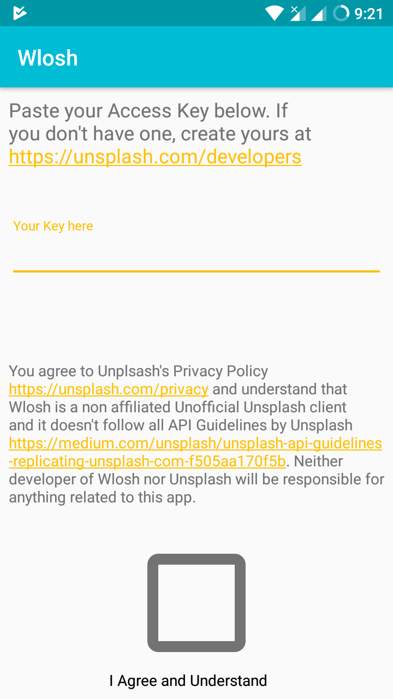
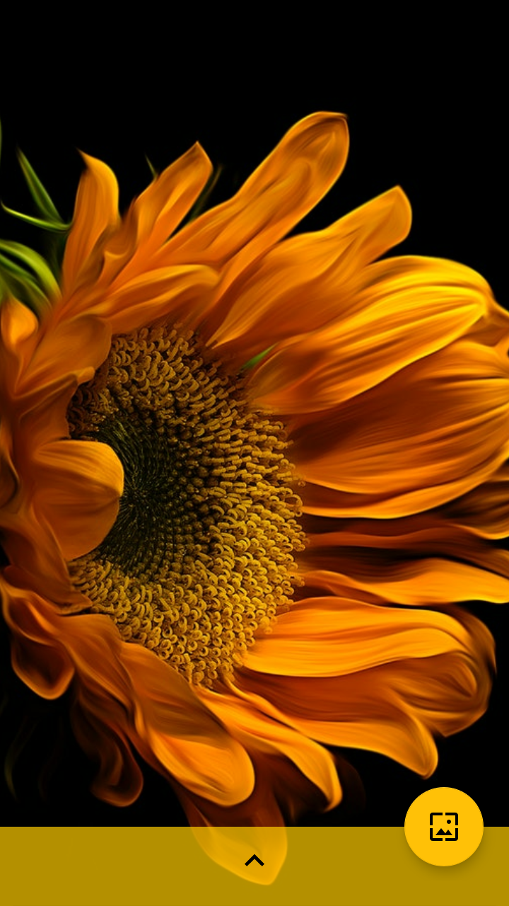
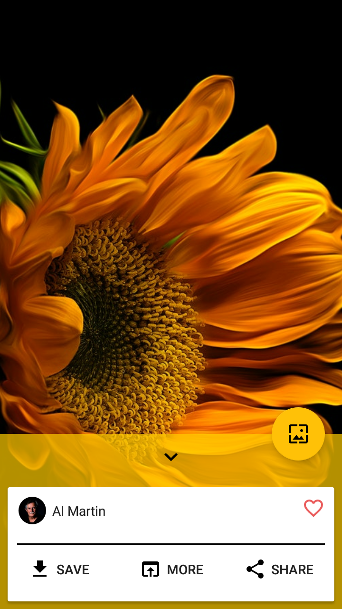
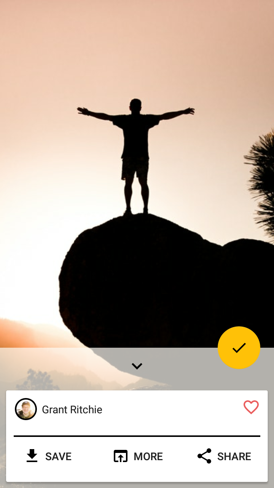
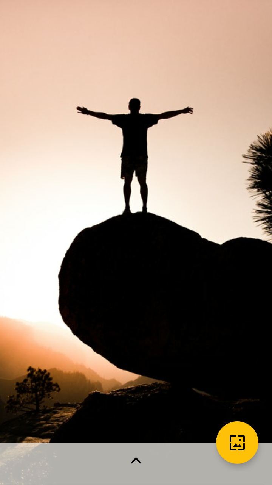
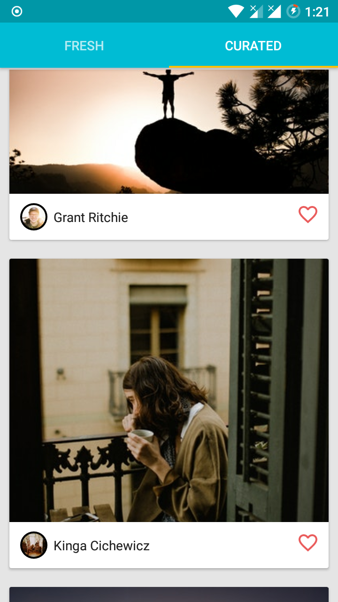
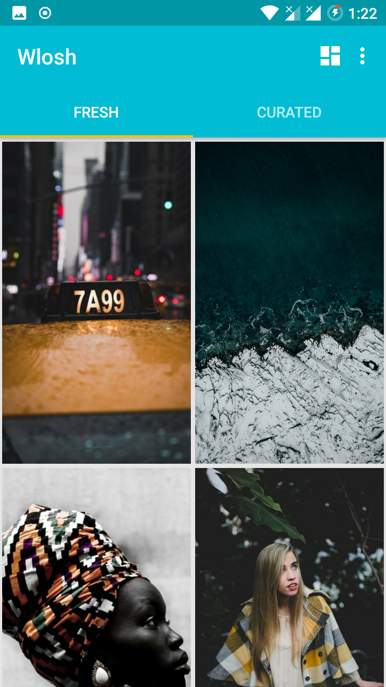
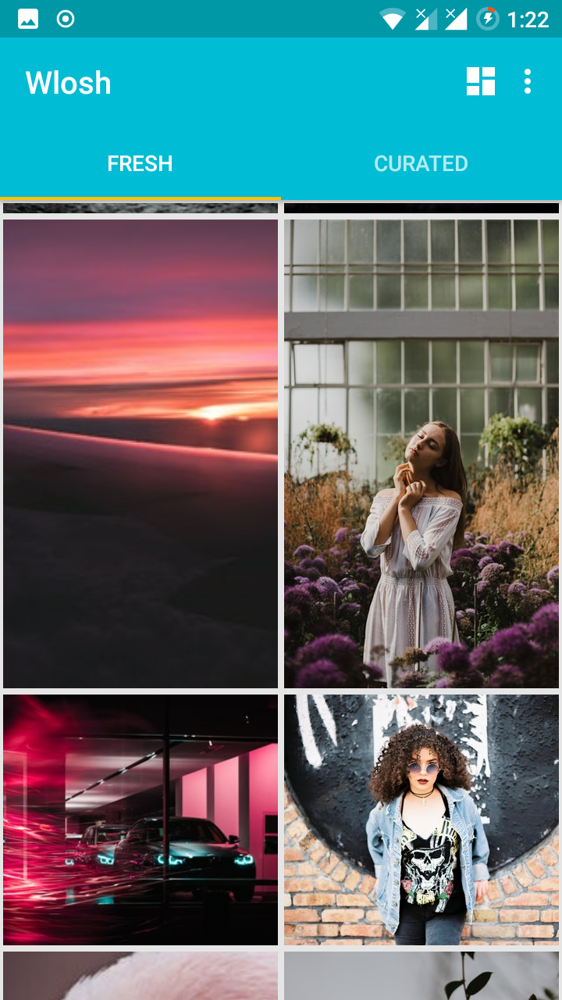

# Wlosh: Wallpapers + Unsplash
<hr>


[](https://opensource.org/licenses/mit-license.php)


<a href='https://play.google.com/store/apps/details?id=in.jatindhankhar.wlosh&utm_source=github-repo&utm_campaign=Github&pcampaignid=MKT-Other-global-all-co-prtnr-py-PartBadge-Mar2515-1'></a>

**This project is in alpha. Expect :bug: and :fire:**
 
* Wlosh is yet another Unsplash client. I made this for my own use and as an excuse to learn Kotlin.
If you find any mistake, then either create an issue or send a Pull Reqest.

## FAQ
#### Q: Why do we have to specify the access key, there are other apps which don't ask for key ?
#### A: Providing key is extra task for user but Unsplash updated their privacy policy, so new apps cannot ship with keys for apps that use Unsplash as an wallpaper app.


## Screenshots

<p float="left">
 









</p>


## Thanks
Big thanks to Unsplash for developing such a cool service. Please don't abuse the API or the Unsplash Platform.
By using this app 

_You agree to Unplsash's [Privacy Policy](https://unsplash.com/privacy) and understand that Wlosh is a non affiliated Unofficial Unsplash client and it doesn't follow all [API Guidelines by Unsplash](https://medium.com/unsplash/unsplash-api-guidelines-replicating-unsplash-com-f505aa170f5b). Neither developer of Wlosh nor Unsplash will be responsible for anything related to this app._


<hr>

**Made with :heart:**
## LICENSE

```text
MIT License

Copyright (c) 2018 Jatin Dhankhar

Permission is hereby granted, free of charge, to any person obtaining a copy
of this software and associated documentation files (the "Software"), to deal
in the Software without restriction, including without limitation the rights
to use, copy, modify, merge, publish, distribute, sublicense, and/or sell
copies of the Software, and to permit persons to whom the Software is
furnished to do so, subject to the following conditions:

The above copyright notice and this permission notice shall be included in all
copies or substantial portions of the Software.

THE SOFTWARE IS PROVIDED "AS IS", WITHOUT WARRANTY OF ANY KIND, EXPRESS OR
IMPLIED, INCLUDING BUT NOT LIMITED TO THE WARRANTIES OF MERCHANTABILITY,
FITNESS FOR A PARTICULAR PURPOSE AND NONINFRINGEMENT. IN NO EVENT SHALL THE
AUTHORS OR COPYRIGHT HOLDERS BE LIABLE FOR ANY CLAIM, DAMAGES OR OTHER
LIABILITY, WHETHER IN AN ACTION OF CONTRACT, TORT OR OTHERWISE, ARISING FROM,
OUT OF OR IN CONNECTION WITH THE SOFTWARE OR THE USE OR OTHER DEALINGS IN THE
SOFTWARE.
```
